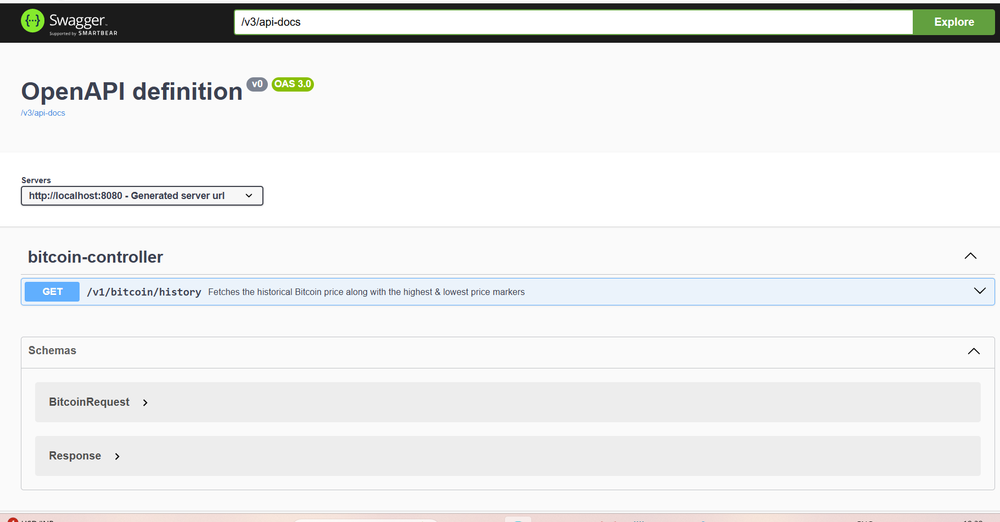

# BitCoin service
    BitCoin service will help to provide history of bitcoin based of start date and end date
    It can provide result for any currency , provided exchange rate value.

# Hexagonal architecture
    We have used hexagonal architecture. This will help to keep the domain clean and independent of the framework and infrastructure. 
    As frameworks and infrastructures change frequently, this architecture ensures our domain/business functionality remains unchanged.
    For more information please [here](https://en.wikipedia.org/wiki/Hexagonal_architecture_(software)) and https://www.baeldung.com/hexagonal-architecture-ddd-spring
# Requirements
    For building and running the application you need:
        Java 17
        Maven 3
# Running the application locally
    To Run application locally
        Start MainApplicationForDevelopment.java from your IDE
    
# Online Mode
    It uses count desk apis to fetch bitcoin prices in online mode.
    for online mode set offline property to false
    
```yaml
    count-desk:
        url: https://api.coindesk.com/
        offline: false
```

# Offline Mode
    It uses in memory cache to fetch bitcoin prices in offline mode.
    for online mode set offline property to false

```yaml
    count-desk:
        url: https://api.coindesk.com/
        offline: true
```
# Documentation
    for documentation click on the below image or go to http://localhost:8080/swagger-ui/index.html#/ after running the application locally.
    
    